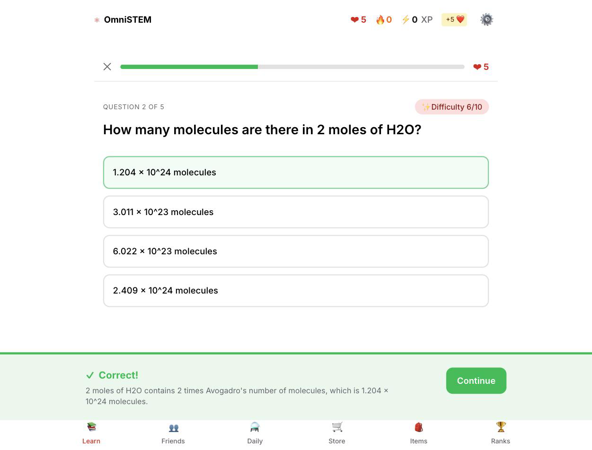
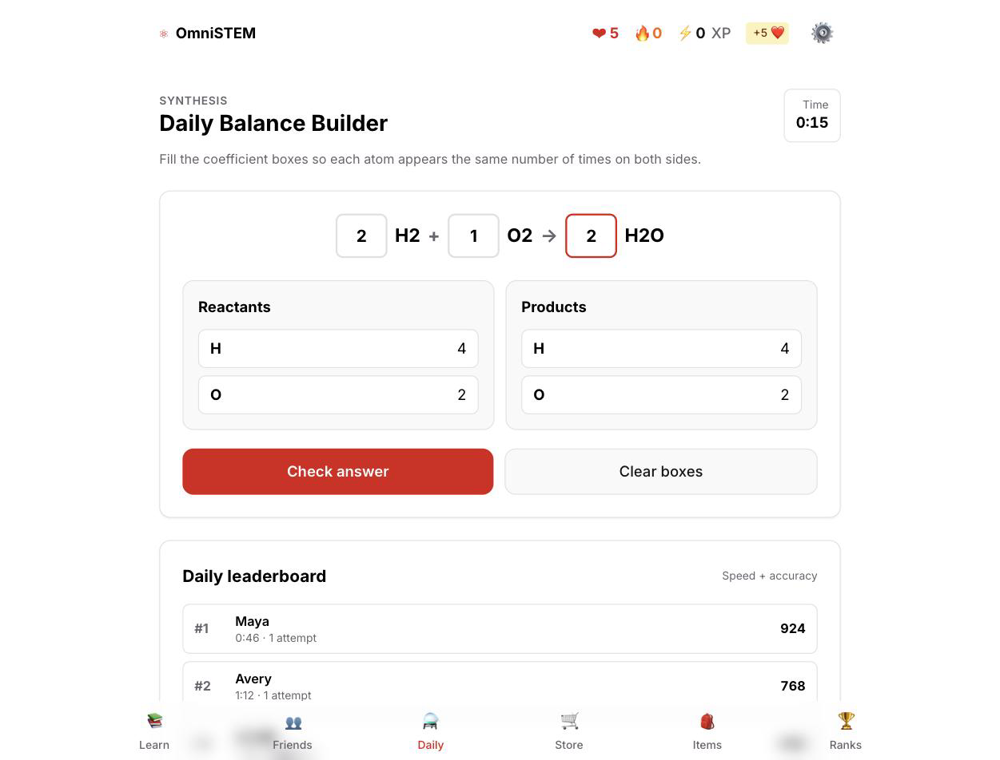
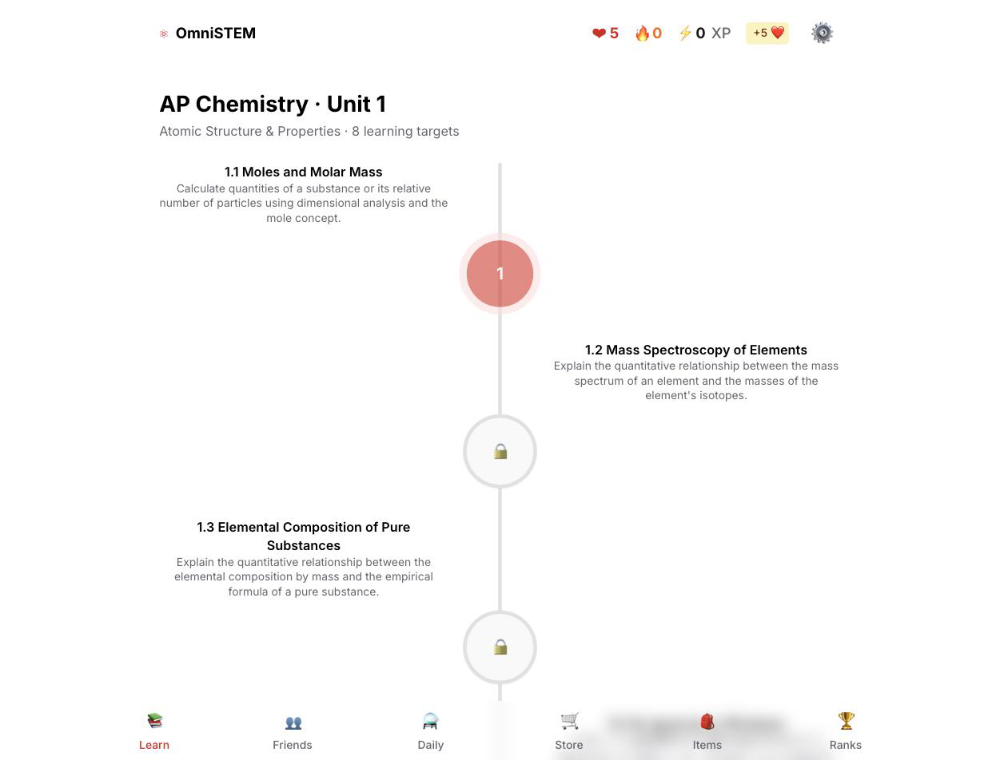
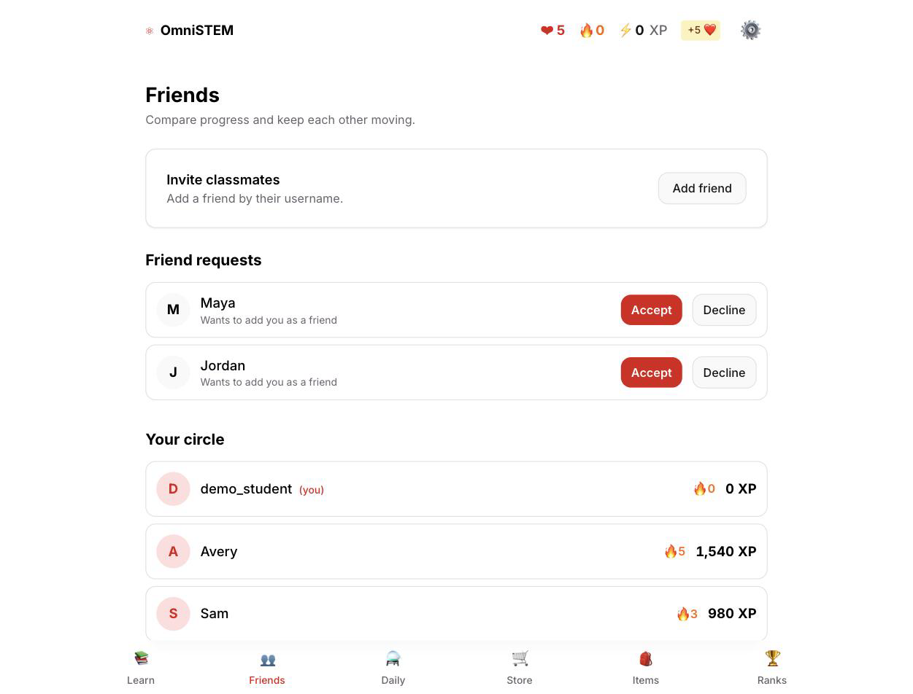

# OmniSTEM

A gamified AP Chemistry web app: Duolingo-style lessons with hearts, XP and streaks, a daily
equation-balancing challenge, friends and an item store. Questions come from GPT-4o, validated
against the College Board CED before use.

**Live demo:** _not deployed yet._

| Lesson player | Daily challenge |
|---|---|
|  |  |
| **Skill tree** | **Friends** |
|  |  |

## Stack

Next.js 14.2 (App Router) · TypeScript (strict) · Tailwind · Zustand · Supabase (Postgres + Auth) · OpenAI GPT-4o · zod

## What works

- **Auth** — Supabase email + password, session refresh in middleware. Without
  Supabase env vars the app runs local-only against `localStorage`.
- **Lessons** — 8 CED learning objectives (Unit 1), four question types (MCQ,
  multi-select, ordering, fill-in), with hearts, XP and streak tracking.
- **AI questions** — generated per objective, validated against a zod schema,
  retried up to 3x on invalid output, falling back to a hand-written seed bank.
- **Daily challenge** — a balance-the-equation puzzle that rotates daily, with a timer and scoring.
- **Friends** — add by username, send/accept/decline, in Postgres with RLS.
- **Store, inventory, leaderboard** — heart refills, streak freezes, XP boosts.
- Dark mode and English/Spanish UI strings.

## Not done yet

- `app/api/daily-puzzle/*` and `lib/seed/puzzles.ts` are an older "Element Match" game that
  nothing calls; the live daily challenge is `app/(app)/daily/page.tsx`.
- No service worker, so the app is installable but not offline-capable.
- Only Unit 1 of the CED is covered, and the friends list and daily leaderboard
  above are seeded demo data when the app runs local-only.

## Architecture

Server components by default. Route handlers under `app/api/` do the work needing a secret or
the database; client components read and write a Zustand store that mirrors to Supabase when
configured and `localStorage` when not. Generation lives in `lib/questions/`, shared by the
route and the eval script.

```
app/(app)      learn, daily, friends, store, inventory, leaderboard
app/api        question generation, topics, lessons, leaderboard
lib/questions  prompt building, zod schema, retry + fallback
lib/store      Zustand stores;  lib/supabase  clients, profile, friends, sync
supabase/      SQL migrations (7 tables, RLS)   scripts/  eval harness
```

## Run locally

```bash
npm install
cp .env.example .env.local   # fill in keys, or leave blank for local-only mode
npm run dev
```

`OPENAI_API_KEY` enables generated questions; without it lessons use the seed bank. The two
`NEXT_PUBLIC_SUPABASE_*` vars enable cloud auth and persistence — apply the migrations in order.

## Generator eval

`npm run eval:questions -- --n 3` checks schema validity, answer-key integrity, duplicate stems, and
— via a second GPT-4o pass at temperature 0 — topic relevance, answer correctness. 24 questions, 8 topics:

| schema | answer key | unique | on-objective | answer correct |
|--------|------------|--------|--------------|----------------|
| 100%   | 100%       | 96%    | 100%         | 96%            |

It flagged one duplicate stem and one disputed answer (the judge was wrong there).

## Credits

Felix Deng ([@Mallard64](https://github.com/Mallard64)), Alexander Lu
([@Tr1ck08](https://github.com/Tr1ck08)), Ethan Li and Yonghai Li.
